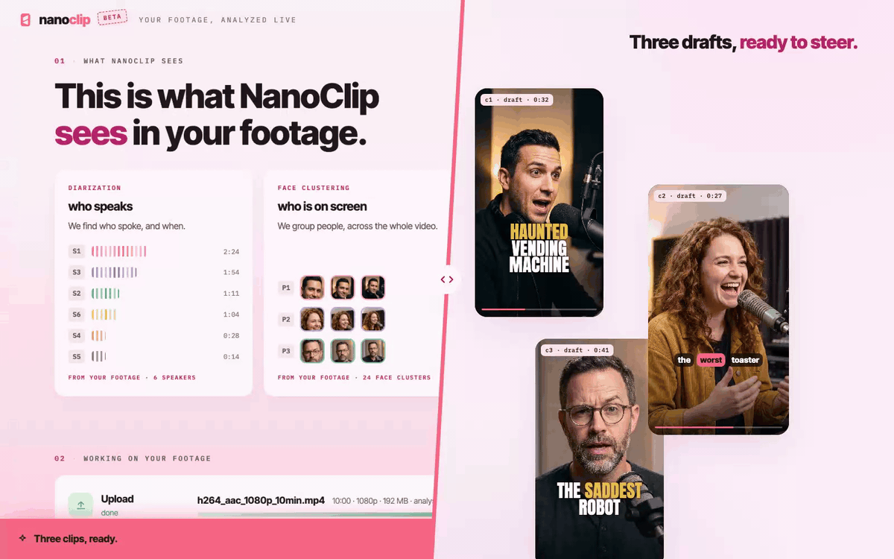

<div align="center">

# nanoclip-cutting-room

**Turn long footage into vertical shorts you'd actually post.**

An open-source skill for [Claude Code](https://claude.com/claude-code).
You talk. It cuts, reframes, captions, renders.

[](SKILL.md)
[](https://www.npmjs.com/package/nanoclip)
[](https://www.npmjs.com/package/hyperframes)
[](LICENSE)

</div>

Point it at a recording. Approve a quote measured in cents. Get three shorts
you'd actually post — then ask for more in plain language.



*One recording, two sides of the stripe: the Screen's live analysis on the
left, the vertical drafts on the right. The faces are AI-generated — an
invented panel from the keyless demo below; yours runs on your footage.*

## A session

```text
you     cut ~/footage/prototype-hour-ep7.mp4 into shorts

claude  Language? Upload the original, or transcode a mezzanine first?
        Quote: transcript + speakers $0.05 · vision $0.80 — $0.85 total. Approve?

you     approved

claude  Dispatched. The Screen is open at 127.0.0.1:4816 — it narrates the
        run on your own footage while you pick a caption style. Zero agent
        tokens burn while the analysis cooks.

        Cast: Rio (host), Juno, Mars. Three clips proposed —
        c1  "I got a DM from a haunted vending machine."   0:58–1:31
        c2  "We shipped it anyway."                        6:12–6:44
        c3  the drone confession, split screen             9:03–9:41

you     start c1 two seconds earlier, and swap c2 for something else

claude  Re-cut from the candidate pool, re-scaffolded. Fresh drafts are
        embedded in the Screen.

you     ship

claude  Finisher gate passed. Three vertical .mp4s rendered locally —
        active-speaker reframe, word-timed captions, every shot switch
        verified on rendered frames.
```

## What you get

- **Clips picked for the hook.** An editorial pass reads the whole recording
  and proposes cuts that open on a quotable line — with a candidate pool
  behind them, so "swap it" is one sentence.
- **A camera that knows who is talking.** Active-speaker reframing: a static
  crop per shot, split screen when two people share the exchange, camera
  state changes only on real scene cuts. No drifting pan-and-scan.
- **Word-timed captions.** Styled from a live catalog you browse in the
  Screen; RTL text comes out right.
- **The Screen.** A page that narrates the run on your own footage — cast
  with face crops, live progress, your drafts embedded and playable.
- **A spend gate.** Analysis is metered: you see the exact USD per line item
  before anything runs, and the CLI refuses overruns. Rendering is local
  and free.
- **Renders that are checked, not eyeballed.** Every delivery passes
  composition checks plus frame-level seam scanners before it reaches you.

## Quick start

```bash
git clone https://github.com/latent-spaces/nanoclip-cutting-room.git
cd nanoclip-cutting-room
node scripts/preflight.mjs
nanoclip auth login
```

Preflight verifies node 20+ and ffmpeg, installs the
[NanoClip CLI](https://www.npmjs.com/package/nanoclip) from npm when it is
missing, and warms the pinned HyperFrames version. The key comes from
[nanoclip.ai](https://nanoclip.ai) — `nanoclip auth login` opens a sign-in
link. Auth is your step — the skill never touches the key.

Then open the folder in Claude Code and say what you want:

> turn this podcast into verticals — ~/footage/ep7.mp4

Claude loads `SKILL.md`, walks the stage playbooks in `references/`, and asks
before spending.

## Try it with nothing

No key, no account, no spend — replay a complete run from the synthetic
fixtures through the real Screen. Two terminals:

```bash
node scripts/server.mjs --dir /tmp/demo-run --port 4816
```

```bash
node scripts/replay.mjs --dir /tmp/demo-run --speed 8 --finale
```

Open http://127.0.0.1:4816 and watch "The Prototype Hour" — an invented
panel show, generated deterministically by `scripts/make-demo-fixtures.mjs` —
land beat by beat, ending with three proposed clips. No real people anywhere
in the repo.

## How it works

| Engine | Role |
|---|---|
| [NanoClip](https://nanoclip.ai) | the intelligence — transcript, speaker diarization, face clustering, active-speaker detection, scene cuts |
| this skill | the editor — per-stage playbooks, a compact digest instead of raw payloads, `plan.json` as the contract, chat as the editing surface |
| [HyperFrames](https://www.npmjs.com/package/hyperframes) | the rendering — each clip is an HTML composition, rendered to .mp4 on your machine |

```text
preflight → intake cards → upload → spend gate → analysis (zero agent tokens)
→ digest → editorial → scaffold → preview in the Screen → iterate in chat
→ Finisher gate → local render → vertical .mp4s
```

NanoClip runs in your browser or in Claude Code. This is the Claude Code half.

## Layout

```
SKILL.md        the router Claude Code loads
references/     per-stage playbooks — intake, screen, digest, editorial, compose, reframe, iterate
scripts/        zero-dependency node — preflight, mezzanine, prefs, watcher, server, catalog,
                replay, digest (+ gap frames), reframe, scaffold (+ extract), captions, render,
                verification tools (switch-scan, switch-lab, player-probe) · tests in scripts/test/
screen/         the Screen page (static HTML/CSS/JS served by scripts/server.mjs)
agents/         Composer / Finisher agent definitions
fixtures/       synthetic demo payloads (an invented show, generated by
                scripts/make-demo-fixtures.mjs) + catalog sample for golden tests
```

Run the suite: `node --test 'scripts/test/*.test.mjs'`.

## License

MIT.
